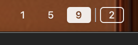

# GlazeWM Indicator

A native macOS menu bar indicator for [GlazeWM](https://github.com/glzr-io/glazewm) workspaces. Requires [GlazeWM](https://github.com/glzr-io/glazewm) to be installed and running.



## Features

- Shows workspace indicators in the native macOS menu bar
- Click to switch workspaces
- Multi-monitor support with display separators
- Auto-reconnects when GlazeWM restarts
- No dependencies beyond macOS 13+

## Install

```sh
brew install --cask vrognas/tap/glazewm-indicator
```

Or download the latest release from [Releases](https://github.com/vrognas/glazewm-indicator/releases).

## Build from source

```sh
git clone https://github.com/vrognas/glazewm-indicator.git
cd glazewm-indicator
swift build -c release
```

## Requirements

- macOS 13.0+
- [GlazeWM](https://github.com/glzr-io/glazewm)

## Usage with GlazeWM

Add to your `~/.glzr/glazewm/config.yaml` to auto-launch with GlazeWM:

```yaml
general:
  startup_commands: ["shell-exec glazewm-indicator &"]
  shutdown_commands: ["shell-exec pkill -x glazewm-indicator"]
```

> **Note:** The `glazewm-indicator` command is installed automatically by Homebrew. If you installed manually, use the full path: `shell-exec '/Applications/GlazeWM Indicator.app/Contents/MacOS/GlazeWMIndicator' &`

> **Startup delay:** The indicator may take ~20 seconds to appear when launched via `startup_commands`. This is because GlazeWM's `shell-exec` introduces a delay through macOS Launch Services before the process starts. The indicator itself connects instantly once running. If faster startup is important, consider launching the indicator independently (e.g., as a macOS Login Item) — it will auto-connect once GlazeWM is available.

## How it works

Connects to GlazeWM's WebSocket IPC server at `ws://localhost:6123`, subscribes to workspace events, and renders workspace indicators as native menu bar items. Workspaces without windows are hidden.

## Credits

- Inspired by [YabaiIndicator](https://github.com/xiamaz/YabaiIndicator), [SpaceId](https://github.com/dshnkao/SpaceId), and [WhichSpace](https://github.com/gechr/WhichSpace)
- Built for use with [GlazeWM](https://github.com/glzr-io/glazewm) by [glzr-io](https://github.com/glzr-io)

## License

MIT
